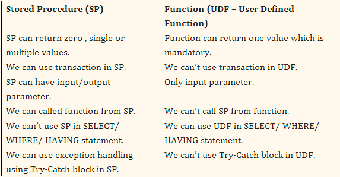

# Хранимые процедуры и функции

В общем и целом это одно и тоже. 
Есть всего пару различий, но они существенны.

## Хранимые процедуры

Процедура - это набор инструкций, которые выполняются последовательно.
Процедура может принимать параметры и возвращать значения.

Процедура может возвращать несколько значений, но только через параметры.

Работает это как ref & out в C#.

Процедура может быть вызвана из другой процедуры, функции, триггера, SQL-оператора.

## Функции

Функция - это набор инструкций, которые выполняются последовательно. 
Да да, я написал тоже самое )) Я знаю 

По сути функция - это процедура, которая возвращает значение, сейчас покажу 
в чем разница.

