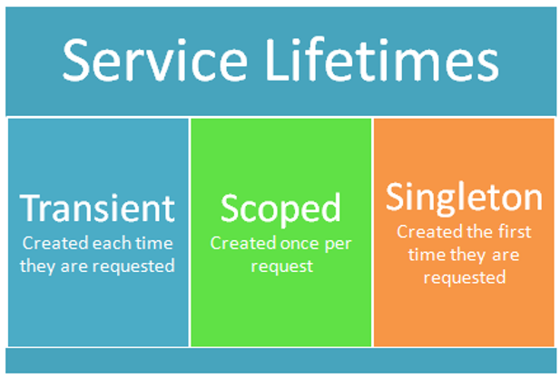

# Введение в прокол HTTP и обзор класса HttpClient

### HTTP

`HTTP` - это Hyper Text Transfer Protocol 

При это вы конечно же можете сделать определенную 
аналогию с `HTML`, который расшифровывается как 
Hyper Text Markup Language. 

Давайте разберемся какое `HTTP` имеет отношение 
к сетевому программированию и почему это чуть ли 
не главный протокол, который вам надо знать. 

Этот протокол был создан 1990 году и по началу просто 
предназначался для передачи гипертекста. 
P.S. `гипертекст` - это то, что скрывается под вашей 
веб страницей. По сути ваш `HTML`

Так как `HTTP` был создан на 7 уровне модели `OSI`,
что является прикладным или Application Lsyer, 
то под капотом он работал на протоколе `TCP`. 
Есть разные версии протокола `HTTP`. 


ЗАПОМНИТЕ !!!

С помощью этого прокола можно скачивать любые данные 
из интернета, а не только веб-страницы... 

Разбор класса `HttpClient` будет в коде )) 


### Из чего состоит HTTP

Каждое HTTP-сообщение состоит из трёх частей,
которые передаются в указанном порядке:

`Starting line` — определяет тип сообщения;
`Headers` — характеризуют тело сообщения,
параметры передачи и прочие сведения;
`Message Body` — непосредственно данные сообщения.
Обязательно должно отделяться от заголовков пустой строкой.


#### Starting line
Говорит о том, что это http request или http response

1. Метод
2. URI
3. Версия

Методы которые вам надо знать - это
- GET. Для запроса данных
- POST. Для отправки данных
- PUT. Для изменения данных
- DELETE. Для удаления данных

`URI`. Состоит из `URL` и `URN`
`URN` - http://google.com
`URL` - /search?q=mercedes/

#### Headers

Заголовки HTTP (англ. HTTP Headers) — это строки в HTTP-сообщении,
содержащие разделённую двоеточием пару параметр-значение.

```http request
Server: Apache/2.2.11 (Win32) PHP/5.3.0
Last-Modified: Sat, 16 Jan 2010 21:16:42 GMT
Content-Type: text/plain; charset=windows-1251
Content-Language: ru
```

#### Body
Это тело сообщения, где вы посылаете данные. 


## Возможность регистрации сервисов 

`Microsoft.Extensions.DependencyInjection`

В общем есть три варианта регистрации сервисов
1. AddTransient 
2. AddScoped
3. AddSingleton

Четвертый это `AddDbContext`, по сути он добавляется 
как `Scoped`, но в этом методе решена проблема 
многопоточности. 



## Middleware

`Chain of Responsibility` - цепочка обязанностей 

Дело в том, что нам надо как-то обрабатывать запросы со стороны 
пользователя и каждый раз делать определенные этапы действий. 

Например нам надо сделать логи в журнал о запросе пользвателя, 
затем проверить что он хочет и вызвать нужный контроллер, при 
этом так же нужно сперва проверить аутентификацию и авторизацию 
пользователя. 

В данном случае цепочка будет такой...

`LoggerMiddleware` =>
`AddAuthentication` =>
`AddAuthorization` =>
`MVCMiddlewware` 


`Middleware` - это подпрограммы, которые по очереди 
обрабатывают ваш запрос по очереди и передают следующему


