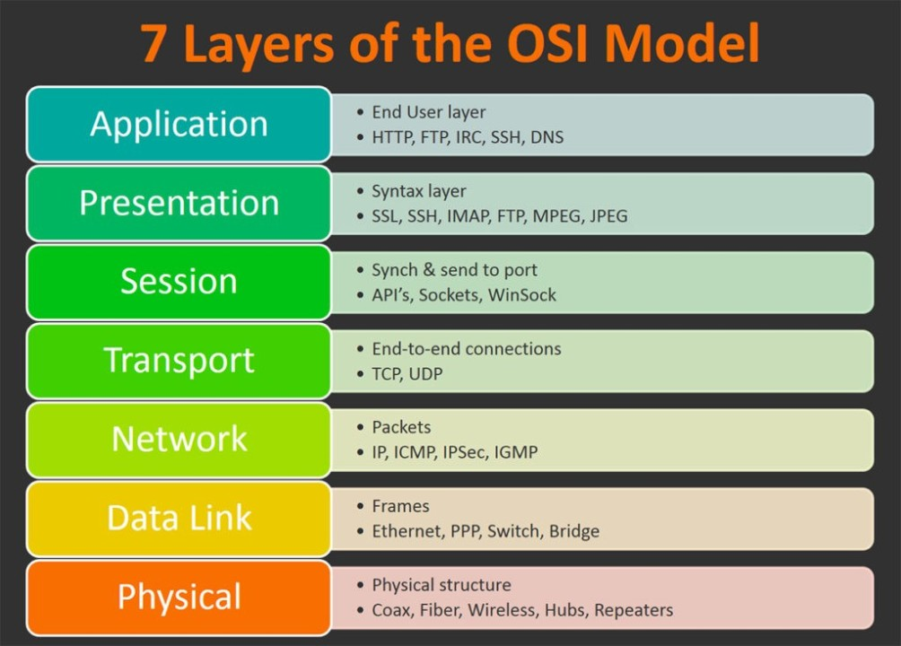

# Intro to network programming 

Сетевое программирование - это предмет на котором 
мы будем изучать строение и принцип работы приложений, 
которые работают по сети. 

## План обучения 
- Введение в сетевое программирование 
- Повтор курса с ITE 
- Простой мессенджер 
- TCP/UDP
- HTTP
- REST
- Broadcast, Multicast, Unicast
- Почтовые протоколы 
- Написание своего веб сервера 
- SignalR

### Введение в сетевое программирование 

Во время этого курса мы будем с вами писать мессенджеры, 
веб сервисы, браузеры, делать запросы на api и многое другое. 
Но самое главное что вы должны понять - это `TCP/UDP` и 
`HTTP`. Возможно также вы уже встречали в разных вакансиях 
словов `REST` и `RESTFUL`

### Вспоминаем модель OSI 

