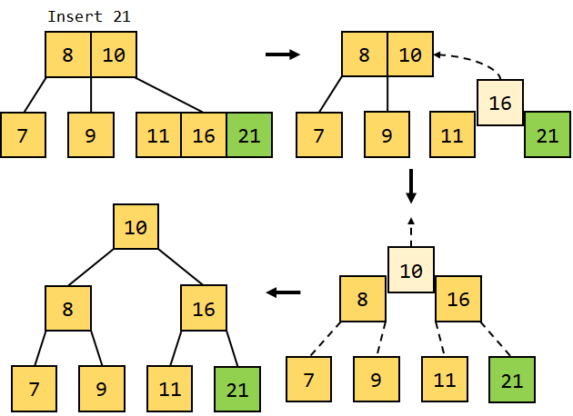

# В планах на сегодня: 
- LIKE statement
- Constraints
- Подробно про основные типы данных
- Первичный ключ
- Выборка и порядок
- Alias
- Условия выборки


## LIKE statement

`LIKE` - оператор сравнения, который позволяет сравнивать значения столбцов с шаблоном. Шаблон может содержать символы подстановки, которые заменяются на любые символы при сравнении.

`%` - любое количество символов, в том числе и 0
`_` - один любой символ
[A-Z] - любой символ из диапазона
[0-9] - любой символ из диапазона

## Constraints

`Constraints` - ограничения, которые накладываются на данные в таблице. Они могут быть накладываться на столбцы или на всю таблицу.

- `NOT NULL` - ограничение, которое не позволяет в столбце хранить значения NULL
- `UNIQUE` - ограничение, которое не позволяет в столбце хранить одинаковые значения
- `PRIMARY KEY` - ограничение, которое не позволяет в столбце хранить одинаковые значения и NULL
- `FOREIGN KEY` - ограничение, которое позволяет связать столбец с другой таблицей
- `CHECK` - ограничение, которое позволяет проверить значения столбца на соответствие условию
- `DEFAULT` - ограничение, которое позволяет задать значение по умолчанию для столбца

## Primary key

`Primary key` - это первчиный ключ. 
Давайте разберем на примере зачем он нам нужен

```sql
create table users(
  id int primary key,
  name nvarchar(50) not null,  
);

create table users(
  id int,
  name nvarchar(50) not null,  
);
```

У нас есть две одинаковые таблицы, но в первой таблице у нас есть первичный ключ, а во второй нет.

Давайте посмотрим на статистику поиска 1000-го элемента в обоих 
таблицах

Primary key работает через принцип кластеризированного 
индекса, который позволяет нам быстро находить элементы в таблице.

Сам кластеризированный индекс - это `B-tree`

Вот пример как он выглядит



При создании Primary key автоматически создается кластеризированный индекс, Unique, Not null


