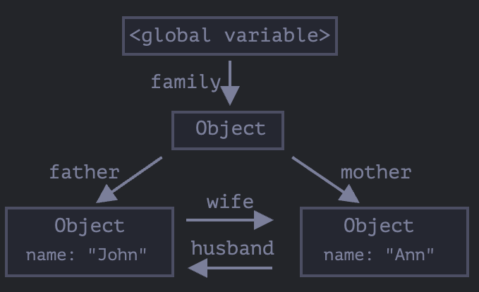
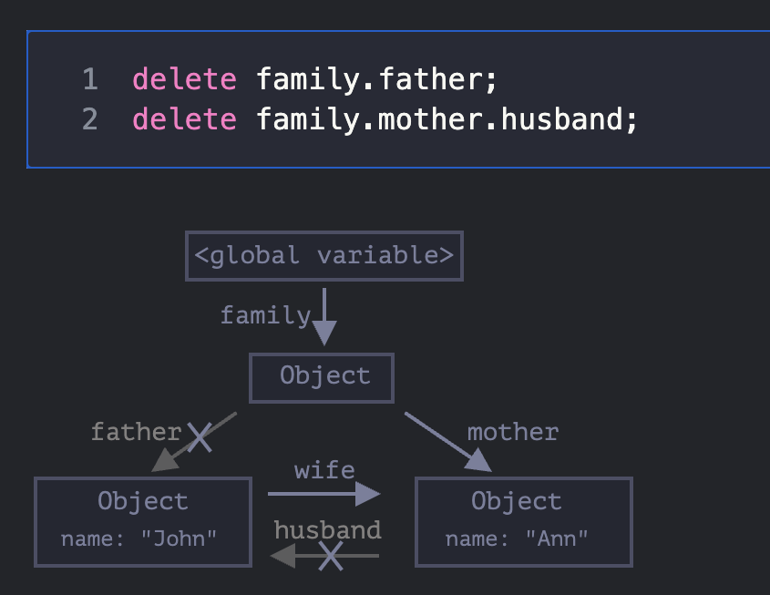
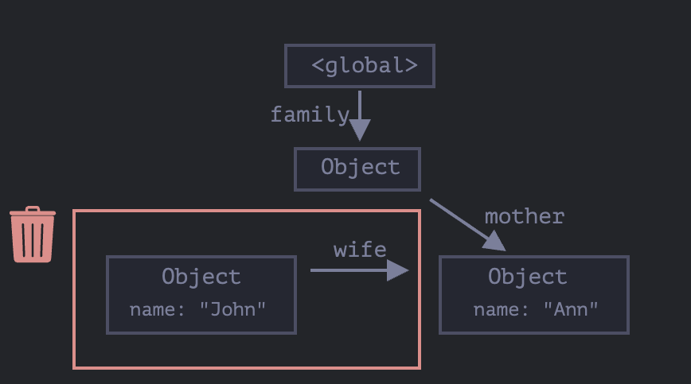

## Garbage Collection in JS

В JS есть механизм сборки мусора. Он автоматически удаляет объекты, которые больше не используются. Это позволяет избежать утечек памяти.
Интересный момент заключается в том, что работает этот механизм почти так же как и в C#. В JS есть `Mark-and-sweep` алгоритм. Он работает следующим образом:

1. **Mark** - алгоритм помечает все объекты, на которые есть ссылки.
2. **Sweep** - алгоритм удаляет все объекты, на которые нет ссылок.

Вот пример утечки памяти:

```js
let element = document.getElementById("element");

function doSomething() {
  let element = document.getElementById("element");
  // do something
}

setInterval(() => {
  doSomething();
}, 1000);
```

В этом примере функция `doSomething
` создает новую переменную `element` каждый раз, когда вызывается. Это приводит к утечке памяти, так как старые объекты не удаляются.

## Interlinked objects

```javascript
function marry(man, woman) {
  woman.husband = man;
  man.wife = woman;

  return {
    father: man,
    mother: woman,
  };
}

let john = { name: "John" };
let ann = { name: "Ann" };

let family = marry(john, ann);
```








# Classes in JS

## 1. Class Declaration

```javascript
class Person {
  constructor(name, age) {
    this.name = name;
    this.age = age;
  }
  greet() {
    console.log(
      `Hello, my name is ${this.name} and I am ${this.age} years old.`
    );
  }
}
```

## 2. Class Expression

```javascript
const Person = class {
  constructor(name, age) {
    this.name = name;
    this.age = age;
  }
  greet() {
    console.log(
      `Hello, my name is ${this.name} and I am ${this.age} years old.`
    );
  }
};
```

## 3. Class Inheritance

```javascript
class Student extends Person {
  constructor(name, age, grade) {
    super(name, age);
    this.grade = grade;
  }
  greet() {
    console.log(
      `Hello, my name is ${this.name} and I am ${this.age} years old. I am in grade ${this.grade}.`
    );
  }
}
```

## 4. Static Methods

```javascript
class Person {
  constructor(name, age) {
    this.name = name;
    this.age = age;
  }

  greet() {
    console.log(
      `Hello, my name is ${this.name} and I am ${this.age} years old.`
    );
  }
  static create(name, age) {
    return new Person(name, age);
  }
}
```

## 5. Getters and Setters

```javascript
class Person {
  constructor(name, age) {
    this._name = name;
    this._age = age;
  }
  get name() {
    return this._name;
  }
  set name(value) {
    this._name = value;
  }
}
```

## 6. Private Fields

```javascript
class Person {
  #name;
  constructor(name) {
    this.#name = name;
  }
  get name() {
    return this.#name;
  }
}
```

## 7. Public Fields

```javascript
class Person {
  name = "John";
}
```

## 8. Mixins

```javascript
let sayHiMixin = {
  sayHi() {
    console.log(`Hello ${this.name}`);
  },
};

class User {
  constructor(name) {
    this.name = name;
  }
}

Object.assign(User.prototype, sayHiMixin);
```

## 9. Extending with Mixins

```javascript
let sayHiMixin = {
  sayHi() {
    console.log(`Hello ${this.name}`);
  },
};

class User {
  constructor(name) {
    this.name = name;
  }
}

Object.assign(User.prototype, sayHiMixin);

let user = new User("John");

user.sayHi();
```

## 10. Protecting Properties

```javascript
class CoffeeMachine {
  _waterAmount = 0;
  set waterAmount(value) {
    if (value < 0) throw new Error("Negative water");
    this._waterAmount = value;
  }
  get waterAmount() {
    return this._waterAmount;
  }
  constructor(power) {
    this._power = power;
  }
}

let coffeeMachine = new CoffeeMachine(100);

coffeeMachine.waterAmount = -10;
```