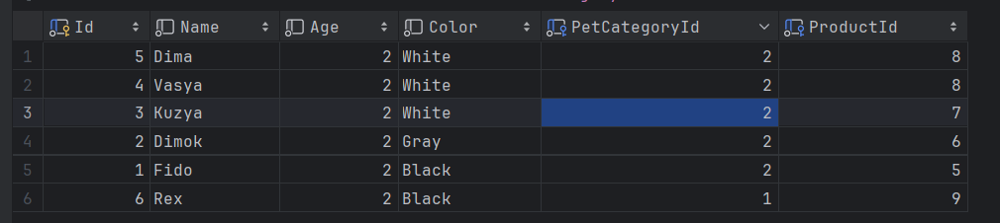
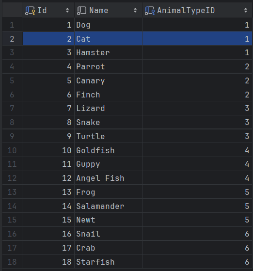
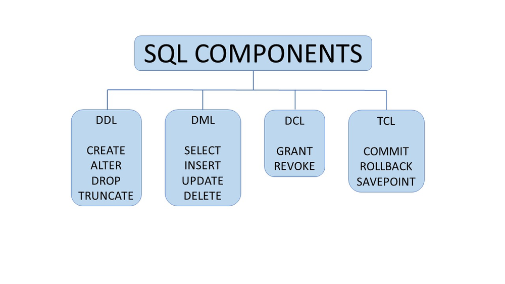

# Введение в предмет MS SQL Server 

MS Sql Server - это система управления базами данных (СУБД) от компании Microsoft, которая является одной из самых популярных СУБД в мире.

MS SQL Server - это `реляционная` СУБД, то есть данные хранятся в виде таблиц, которые могут быть связаны между собой.

### Реляционная модель данных

Вообще вы должны понимать, что `реляционная` база данных - это система таблиц, которые могут быть связаны между собой. Тут слово `реляционная` означает, relation - отношение. 

Как выглядят эти таблицы ?

Вот так выглядит таблица в MS SQL Server. Таблица состоит из столбцов и строк. Столбцы - это поля таблицы, а строки - это данные.

## SQL 

`SQL` - это язык структурированных запросов. Это язык, который позволяет работать с данными в базе данных. Он был создан в 1986 году, компанией IBM. Во время создания языка, его называли SEQUEL(Structured English Query Language), но потом в 1989 году было решено переименовать его в SQL.

В `MS SQL Server` используется более расширенная версия этого языка созданная компанией Microsoft, которая называется T-SQL (Transact-SQL). Слово `Transact` исходит от слова `Transaction`. Да, речь о той самой транзакции, которую мы используем при переводе денег на банковскую карту.

`SSMS` - Sql Server Management Studio - это программа, которая позволяет работать с базой данных. 
Привожу аналогию всего сверху и C#

`MS SQL Server` - это .NET Core
`T-SQL` - это `C#`
`SSMS` - это `Visual Studio` для работы с базой данных.

## ИМХО про SSMS

Я считаю, что SSMS это самая ужасная программа, которую я видел. Она не дает нормальных подсказок, постоянно показывает ошибки, которые не являются ошибками. Иногда с ней бывают баги

По сути это единственная программа, которая позволяет работать с базой данных, поэтому мы не можем ее не использовать. 
Но я бы рекомендовал использовать другие программы, которые позволяют работать с базой данных. Например, `JetBrains DataGrip` или `Azure Data Studio`.

Мы с вами будет работать с `JetBrains DataGrip`, но иногда я буду показывать примеры в `SSMS`, потому что только в ней можно запустить некоторые примеры. 

# ЗАПОМНИТЕ !!!

SQL - это декларативный язык. Это означает, что вы пишите код, который описывает, что вы хотите получить, а не как это сделать.

SQL - это не язык программирования. Это язык запросов.

Да, хоть и в `T-SQL` можно создавать переменные, условия, циклы, но это не язык программирования. Это язык запросов.

# В SQL есть 4 основных части синтаксиса

`DDL` - Data Defintion Language
`DML` - Data Manipulation Language
`DCL` - Data Control Language
`TCL` - Transaction Control Language

